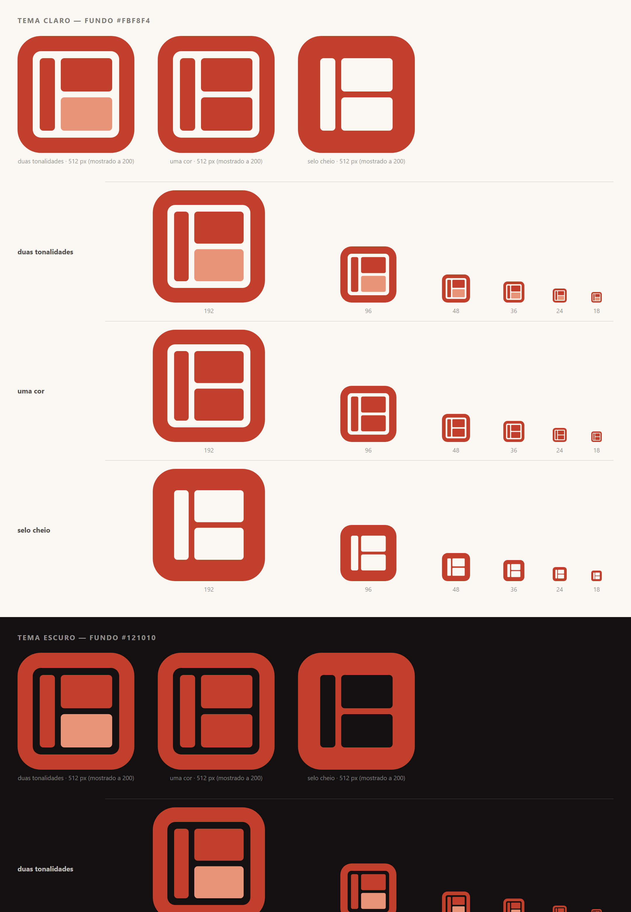
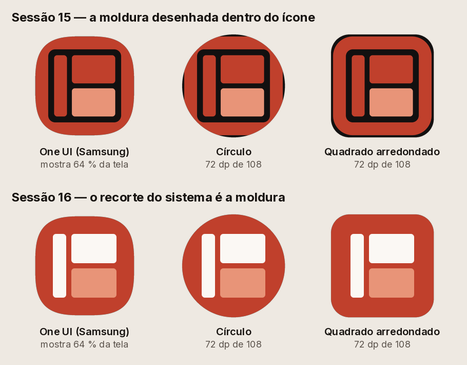

# A marca do Bricklap

Escolhida pelo fundador e desenhada na sessão 15. Uma **moldura quadrada vazada** com três peças lá dentro: o **pilar** à esquerda, e dois retângulos à direita, alinhados com ele. As três peças juntas leem-se como **B**; o pilar com o retângulo de baixo, na tonalidade clara, lê-se como **L**.

## Regras para desenhar a marca — decisão do fundador, 2026-09-15 (sessão 24)

**As regras abaixo nesta página foram escritas na sessão 15, antes de haver medições.** Com elas, as sessões 18, 19 e 19b geraram e mediram 200 variantes que convergiram sempre para tijolos empilhados, e a leitura dupla que o fundador quer — uma forma que é também uma letra ou uma ideia — ficou impossível por construção (o espaço negativo precisava de curvas ou de uma moldura, e a moldura já tinha morrido: [DECISOES-DESCARTADAS](../DECISOES-DESCARTADAS.md), entradas 2 e 3). **O fundador decidiu abri-las.** O texto completo, com a tabela das regras substituídas, está no [DESIGN.md §8b](../DESIGN.md#regras-de-desenho-de-uma-marca-nova--decisão-do-fundador-2026-09-15-sessão-24).

- **Passa a ser legal:** curvas verdadeiras; inclinação; uma cor só (as duas tonalidades deixam de ser obrigatórias); qualquer número de peças, ou uma só; o 3D **como método** — modelar, rodar e ficar com a silhueta plana.
- **Continua proibido, por medição:** o **resultado** parecer 3D — volume, sombreado, gradiente, perspetiva visível. A 24 px um cubo é uma mancha (as faces têm luminâncias diferentes e o antisserrilhado mistura-as), e a notificação é monocromática: um volume sem sombreado deixa de ser volume.
- **Não se tocam:** legível a 24 px; sobrevive ao recorte circular do ícone adaptativo; funciona a uma cor; não se lê como controlo de interface (lista, menu, barra lateral, painel, indicador de carregamento, marca de corte, botão de reprodução, pasta, gráfico de barras, cronómetro — e, desde a sessão 25, o visto, o cadeado e o sinal de wi-fi; e, desde a sessão 26 (decisão do fundador), o olho, o ícone de mostrar e ocultar; um controlo fora da lista também chumba).
- **Originalidade:** a silhueta compara-se com 35 símbolos de marcas existentes, do fitness e de fora dele. Desde a sessão 25 a régua é **relativa**: sinaliza-se quando a semelhança com uma marca excede em mais de 0,20 a semelhança com um disco ou um quadrado cheios (o corte absoluto de 0,40 da sessão 24 ficou suspenso: eliminava a própria P2122). A leitura humana continua a decidir.

**O que isto não muda:** a marca de trabalho que está hoje na app (a moldura e as três peças, abaixo) continua a ser a que se usa, com as suas regras de uso, até o fundador escolher outra. As regras que caíram estão anotadas onde aparecem, e não foram apagadas.

## Cor

| Papel | Hex | Onde |
|---|---|---|
| **O B** | `#C0402C` | a moldura, o pilar e o retângulo de cima |
| **O L** | `#E89478` | o retângulo de baixo, e só ele |
| Creme | `#FBF8F4` | o pilar e o retângulo de cima **no ícone da app**, e o fundo do arranque; é o `fundo` do tema claro |
| Preto | `#16120F` | fundos difíceis; é a `tinta` do tema claro |
| Branco | `#FFFFFF` | fundos difíceis e o ícone de notificação |

### A regra da cor

> **Substituída como regra de desenho em 2026-09-15** (decisão do fundador, sessão 24): uma marca nova pode ser a uma cor, e as duas tonalidades deixam de ser obrigatórias. As medições que já a tinham partido estão nas [DECISOES-DESCARTADAS](../DECISOES-DESCARTADAS.md), entrada 5. Para a marca de trabalho que está na app, o texto abaixo continua a descrever o que ela é.

**A distinção entre o B (`#C0402C`) e o L (`#E89478`) é a alma da marca e mantém-se em todas as aplicações visíveis** — ícone da app, ecrã de arranque, cabeçalho, documentos. Decisão do fundador, e é uma **regra, não uma preferência**: a versão a uma cor não é uma alternativa estética entre duas, é o que se usa quando a técnica não deixa usar duas.

**A uma cor existe para três casos, e só para esses:**

1. **O ícone de notificação do Android.** O sistema obriga a monocromático: pinta a silhueta e ignora as cores que lá estiverem.
2. **Favicon.**
3. **Tamanhos abaixo de 24 píxeis renderizados**, onde os píxeis não chegam para duas tonalidades — ver *Tamanhos mínimos*.

Fora destes três, usar a uma cor onde cabiam duas é um erro, não uma escolha.

### Duas notas honestas sobre estas cores

- **O `#E89478` está em matiz 15,0°**, exatamente no limite que o [DESIGN.md](../DESIGN.md) §8 fecha ("nada entre 15° e 45° em nenhum token"). O `#C0402C` está a 8,1°, dentro da família do acento da app (7,2° no tema claro, 7,3° no escuro) — é a mesma terracota, não uma segunda cor. O L é o único valor da identidade que toca a fronteira do laranja. Fica registado porque foi decisão do fundador e porque quem ler a regra do §8 daqui a um ano merece saber que isto foi visto e aceite, não esquecido.
- **O contraste entre o B e o L é 2,23:1.** É baixo por desenho — são duas tonalidades da mesma cor, não duas cores. É também a razão por que a marca **pede fundo escuro** quando as duas tonalidades têm de brilhar: sobre `#121010` o B dá 3,62:1 e o L 8,07:1; sobre um fundo claro (`#FBF8F4`) o L cai para **2,22:1** e quase desaparece. É por isso que o ícone do Android leva fundo escuro.

## Tamanhos mínimos

Medido, não estimado. Na grelha de 100, cada retângulo da direita mede 44 × 28,5 e o vão entre eles 5. Rasterizando a marca a cada tamanho e contando os píxeis de cor que sobrevivem ao antisserrilhado:

| Tamanho | Altura da peça | Vão | Píxeis limpos do L | Leitura |
|---:|---:|---:|---:|---|
| 48 px | 13,7 px | 2,40 px | 240 | as duas tonalidades distinguem-se |
| 36 px | 10,3 px | 1,80 px | 148 | distinguem-se |
| **24 px** | 6,8 px | **1,20 px** | 60 | **o último tamanho em que se distinguem** |
| 18 px | 5,1 px | **0,90 px** | 28 | o vão desce abaixo de 1 px e as peças colam |

**A fronteira é 24 px.** De 24 para cima, duas tonalidades. Abaixo de 24, uma cor — não porque fique melhor, mas porque a outra deixa de ser verdade.

**São píxeis renderizados, não `dp` nem pontos.** Num ecrã a 3× (a maioria dos telemóveis de hoje), 24 dp são **72 px** e a marca está muito acima da fronteira; num ecrã a 1× são 24 px e está em cima dela. Quem aplicar a regra tem de contar os píxeis que a imagem vai mesmo ter, não a medida do esquema. É por isso que o logótipo do cabeçalho da app, desenhado a 26 dp, **tem de** mostrar as duas tonalidades: no telemóvel do fundador (450 ppp) são 73 px. *Na sessão 15 este parágrafo dizia que as mostrava, e não mostrava — ver "Na app".*

## Qual variante, em que contexto

| Contexto | Ficheiro |
|---|---|
| Uso geral, ≥ 24 px | `bricklap-logo.svg` |
| **Ícone da app** | `bricklap-icone-app.svg` — ver *O ícone da app* |
| **Ícone de notificação do Android** | `bricklap-notificacao.svg` — ver *O ícone de notificação* |
| Ecrã de arranque | `bricklap-logo.svg`, a duas tonalidades, sobre `#FBF8F4` |
| Favicon, < 24 px renderizados | `bricklap-logo-uma-cor.svg` |
| Fundo claro difícil (impressão a uma cor, fotocópia) | `bricklap-logo-preto.svg` |
| Fundo escuro ou fotografia | `bricklap-logo-branco.svg` |
| Marca com a palavra ao lado | `bricklap-horizontal.svg` (preto e branco: `-preto`, `-branco`) |
| Registo da sessão 15, **não usar** | `bricklap-selo.svg` — o selo cheio de peças vazadas, que o fundador não escolheu |

A palavra da versão horizontal é **Archivo Expanded Bold (700)**, a mesma família dos números da app, **convertida em contornos**: um logótipo que depende de a fonte estar instalada em quem o abre não é um logótipo. O 700 foi escolhido contra o 800 porque acompanha o traço da moldura sem competir com ele, e porque as contraformas continuam abertas a 20 px, onde o 800 começa a fechar ([comparação](versao-horizontal.png)).

## Espaço livre

**Um quarto do lado da marca**, livre de tudo, em todo o redor. Numa marca de 48 px são 12 px; na versão horizontal mede-se pelo lado da moldura, não pela largura total. Dentro desse espaço não entra texto, nem contorno, nem a aresta de um cartão.

## Nunca

- **Deformar.** A marca é quadrada; escala-se sempre com as duas dimensões iguais.
- **Mudar as cores**, inverter o B e o L, ou pintar cada peça de uma cor.
- ~~**Rodar** ou inclinar, em qualquer ângulo.~~ **Saiu em 2026-09-15** (decisão do fundador, sessão 24): a inclinação passa a ser legal no desenho da marca. Rodar a marca de trabalho que já existe continua a ser deformá-la; desenhar uma marca inclinada deixou de ser proibido.
- **Sombras, brilhos, gradientes, contornos duplos.** A marca é plana, como o resto do sistema visual. *(Mantém-se desde 2026-09-15 no resultado; o 3D passou a ser legal como método de desenho, desde que o que sai seja uma silhueta plana.)*
- **Redesenhar as peças** — mudar o vão, a espessura da moldura, o raio dos cantos. As proporções estão fixadas abaixo.
- **Usar a uma cor** onde as duas tonalidades cabem. *(Na marca de trabalho. Como regra de desenho, substituída em 2026-09-15: uma marca nova pode ser a uma cor.)*
- **Pôr a marca sobre uma fotografia** sem ser a versão a branco ou a preto.
- **Desenhar a moldura dentro do ícone da app.** O sistema já recorta o ícone; uma moldura lá dentro dá dois quadrados encaixados — ver *O ícone da app*.

## O ícone da app

**Decisão do fundador, sessão 16**, depois de ver a app instalada. O ícone da app **não é a moldura desenhada dentro de um quadrado**, nem o selo de peças vazadas: é o **campo `#C0402C` a toda a tela**, com as três peças **a claro** — o pilar e o retângulo de cima em `#FBF8F4`, o de baixo em `#E89478`. **O recorte do sistema é a moldura.**

**Porque a moldura desenhada falhou** (medido no lançador do telemóvel do fundador, One UI 8.5): o Android promete mostrar os 72 dp centrais de uma tela de 108, e cada fabricante recorta como quer. O One UI mostra **64,2 %** da tela; a moldura da sessão 15 ocupava **64,0 %**. O contorno da marca e o recorte do sistema eram a mesma linha — a moldura deixava de se ver como forma, o seu traço vermelho passava a fundo, e o ícone lia-se como um **selo cheio**. Nos lançadores que recortam menos, via-se o contrário: **dois quadrados encaixados**, o do sistema e o da marca. Um ícone que depende de quanto o sistema recorta está errado em todos.

**Como a regra da cor se aplica aqui.** O B passa a ser o campo, e as peças que o formam ficam a claro; **o L continua a ser `#E89478`**, e continua a distinguir-se — do campo e do creme. Os números, porque são baixos: o creme sobre o campo dá **4,95:1**; o L sobre o campo **2,23:1**, e o L sobre o creme **2,22:1**. O L fica a meio caminho entre as outras duas cores do ícone (2,23 × 2,22 = 4,95). Distingue-se, mas é a peça mais fraca do ícone, e isso foi visto, não esquecido.

**A medida.** O campo das peças ocupa **62 % da janela de 72 dp** — a mesma proporção entre o campo e a moldura que a marca tem (62 em 100) —, ou seja 44,64 dp numa tela de 108 (**41,3 %**). No One UI isso dá 64 % do ícone visível. É também a medida que cabe na zona segura dos lançadores de recorte circular: o canto mais afastado das peças fica a 61,3 dp de diâmetro, dentro dos 66 dp garantidos. A comparação de escalas (58, 64 e 70 % do ícone) fez-se no lançador real, ao lado das aplicações vizinhas, antes de aplicar.

O **monocromático** (ícones temáticos do Android 13+) são as mesmas três peças a branco, na mesma medida: sem moldura, pela mesma razão.

## O ícone de notificação

O Android obriga a uma silhueta: pinta o canal alfa e ignora a cor. É o primeiro dos três casos técnicos da regra da cor. Na sessão 15 a silhueta era a marca inteira a encher a tela de 24 dp, e o fundador leu-a como **"um tijolo gigante, muito bruto"**: na barra de estado do telemóvel dele desenhava-se a **39 px**, mais alta do que os algarismos do relógio (28 px) e mais pesada do que qualquer ícone ao lado.

**O ícone é as três peças, com o pilar cheio e os dois retângulos em contorno**, numa área de 20 dp dentro da tela de 24 (a margem de 2 dp dos ícones de sistema), com traço de 2 dp e cantos de 1,5. Na barra real desenha-se a **32 px** — da altura do ícone do USB (31) e abaixo do cata-vento (35).

Escolhido entre três tratamentos **postos na barra de estado real** do telemóvel do fundador, sobre a app e sobre a gaveta:

| Tratamento | Na barra real | Leitura |
|---|---|---|
| A — só a moldura, em traço fino | 32 × 32 px | leve e de sistema, mas é um quadrado vazio: não diz Bricklap e confunde-se com "parar" |
| B — só as duas peças da direita, cheias | 23 × 32 px | continua a ser um bloco, só mais estreito |
| **C — as três peças em contorno** | **32 × 32 px** | **o traço tem o peso dos ícones vizinhos, e é o desenho do ícone da app** |

Um refinamento depois da captura: em contorno, o pilar (13 de 62 do campo, 4,2 dp) não tem largura para dois traços de 2 dp e uma cavidade — ficava com um fio de menos de 1 px no meio, visível na barra. **Cheio**, pesa o mesmo que dois traços e desenha-se limpo.

## A marca não está registada

**Nota do CTO.** Não há verificação no [TMview](https://www.tmdn.org/tmview/) nem no [INPI](https://inpi.justica.gov.pt/). Até isso acontecer:

- **Não tratar a marca como definitiva.**
- **Não a usar fora deste repositório e da app** — nada de sítio público, loja, redes ou material impresso.

A verificação é **tarefa do fundador**, quando houver alguma coisa pública para lançar.

## Marca de trabalho, congelada

**Nota da sessão 26 (2026-09-18, decisão do fundador): a marca e o nome ficam em standby por tempo indeterminado.** A **P2122** é a marca de trabalho e **"Bricklap"** o nome de trabalho. As duas famílias afinadas na sessão 25 — o arco de tijolos (AR) e a volta torcida (GI) — **fecharam** nas [DECISOES-DESCARTADAS](../DECISOES-DESCARTADAS.md), entradas 8 e 9; e o olho entrou na lista negra (acima). As regras de desenho da sessão 24 ficam escritas para quando a marca reabrir. A nota do CTO abaixo continua a valer.

**Nota do CTO, sessão 16.** A marca fica **congelada como marca de trabalho**: não se redesenha mais nas sessões de desenvolvimento. A recomendação é **levá-la a um designer profissional antes de a app ser mostrada a estranhos**. Este documento existe também para isso: as direções, as cores, as medidas e o raciocínio — incluindo o que falhou e porquê — já estão escritos, o que reduz o trabalho e o custo de quem pegar nela.

## Geometria, para quem tiver de a redesenhar

Grelha de 100. Todos os ficheiros saem destes números — se algum divergir, o errado é o ficheiro.

| Medida | Valor |
|---|---|
| Lado | 100 |
| Raio exterior da moldura | 20 |
| Traço da moldura | 13 |
| Raio interior | 7 (= 20 − 13) |
| Folga entre a moldura e as peças | 6 |
| Campo útil | 62 × 62, de (19,19) a (81,81) |
| Pilar | 13 de largura, 62 de altura |
| Vão | 5 |
| Retângulos da direita | 44 × 28,5 cada |
| Raio das peças | 3 |

**A moldura e o pilar têm o mesmo peso, 13.** Foi o que fechou o desenho: com o pilar mais fino do que a moldura, a barra lia-se como um resto; com a moldura mais grossa, o interior era esmagado.

## Na app

### As medidas de cada ficheiro, para quem os voltar a gerar

Não são gosto: saem do que o Android garante mostrar de cada imagem, e isso **mede-se no telemóvel**, não se lê só na documentação — a sessão 15 seguiu a documentação e errou (ver *O ícone da app*).

| Ficheiro | O que tem | Medida |
|---|---|---|
| fundo do adaptativo | a cor `#C0402C` (`adaptiveIcon.backgroundColor` no `app.json`), sem PNG | toda a tela |
| `android-icon-foreground.png` | as três peças, creme e L, sem moldura | campo a **41,3 %** da tela (62 % da janela de 72 dp) |
| `android-icon-monochrome.png` | as três peças a branco | 41,3 % |
| `icon.png` (Android 7, sem máscara do sistema) | o ícone da app num quadrado de cantos de 20 % | quadrado a 87,5 % da tela |
| `marca/notificacao-*.png` | pilar cheio e retângulos em contorno, a branco | 20 dp em 24; traço de 2 dp |
| `marca/arranque-*.png` | a marca a duas tonalidades | **144 dp numa tela de 288** — o Android 12+ só garante um círculo de 192 dp |

### O arranque

Pôr o logótipo nos drawables, como a sessão 15 fez, não chegava, e só se viu ao **gravar o ecrã** num arranque a frio (uma captura não o apanha: o arranque dura menos do que ela). O template do Expo usava o PNG diretamente como fundo da janela — esticado ao ecrã inteiro no Android < 12 —, e no Android 12+ o sistema ignorava-o: o telemóvel do fundador (Android 16, modo escuro) mostrava o ícone do lançador a expandir sobre vermelho, **um fotograma escuro**, e só depois o creme da app. O creme com a marca nunca aparecia. Desde a sessão 16 o plugin define os estilos: fundo da janela = o creme com a marca centrada, fundo e ícone do arranque do Android 12+ = o creme e a marca, e o `AppTheme` com fundo creme. Gravado de novo no mesmo telemóvel: a gaveta funde para creme, a marca a duas tonalidades aparece, e o fotograma escuro deixou de existir.

### Os componentes

`apps/mobile/ui/logotipo.tsx` desenha a mesma geometria em `react-native-svg`. **Na sessão 15 saiu a uma cor**: o componente fazia `corL ?? corB`, e sem cores pedidas o L caía no B. As cores estão agora em `ui/coresDoLogotipo.ts`, com um teste (`apps/mobile/test/logotipo.test.ts`) que falha se o logótipo sem argumentos deixar de ter duas tonalidades.

Os PNG do Android saem de `apps/mobile/assets/` e `apps/mobile/assets/marca/`, e o plugin `apps/mobile/plugins/withRecursosDaMarca.js` põe o ícone de notificação e o logótipo de arranque nos drawables por densidade e define os estilos do arranque, porque `android/` é gerado pelo `expo prebuild` e não vive no git.

### O nome no cabeçalho, e uma honestidade sobre ele

Desde a sessão 15 o cabeçalho do Início, do Histórico e da retoma tinha só o símbolo; a sessão 17 pôs a palavra **"Bricklap" de volta**, ao lado dele, em `apps/mobile/ui/logotipoComPalavra.tsx`. A palavra vai em **Archivo Expanded** — a mesma família do lockup horizontal acima, e a exceção que o [DESIGN.md](../DESIGN.md) §3 regista para ela, não para o texto corrido.

**Isto não é um wordmark a sério.** O alinhamento — o tamanho da palavra face ao símbolo, o vão entre os dois, o ajuste vertical para o descendente do "p" — foi escolhido a olho, comparando três tratamentos no ecrã real do telemóvel do fundador, não desenhado por um tipógrafo com as ferramentas certas (guias de altura-x, curvas de tensão óptica). É trabalho da mesma qualidade que o resto da marca: uma direção defensável, não uma peça acabada. Continua a valer a nota de "Marca de trabalho, congelada" acima — um designer profissional a rever isto acerta o que aqui foi feito a olho.
